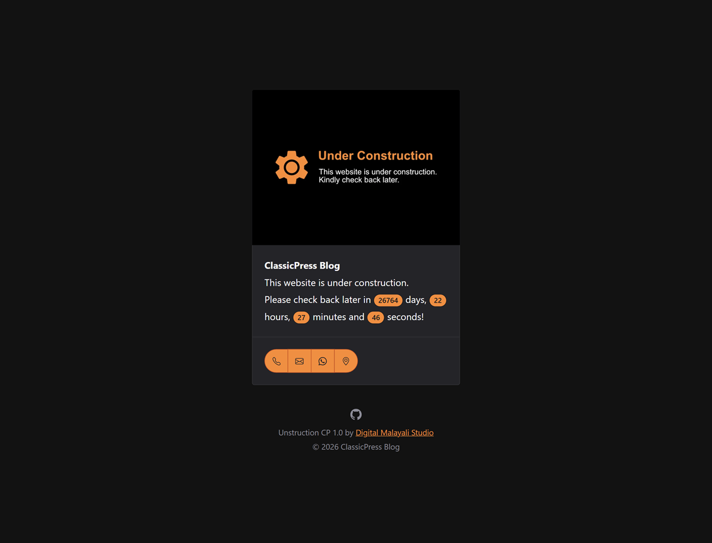

# Unstruction CP

A free ClassicPress theme for quickly setting up a "Coming Soon," "Under Construction," or "Under Maintenance" page. Built with Shoelace web components, it includes a countdown timer to show visitors when your site will launch or reopen, and it's lightweight, responsive, and automatically adapts to light or dark mode.

**Version**: 1.0  
**Contributors**: Digital Malayali Studio  
**Requires at least**: 4.9     
**Requires CP**: 1.2  
**Tested up to**: 2.7.2  
**Requires PHP**: 7.4  
**Text Domain**: unstruction-cp  
**Tags**: one-column  
**License**: GPLv3

## Features

- **Two Modes:** Easily switch between "Under Construction" and "Under Maintenance".
- **Countdown Timer:** Live countdown showing days, hours, minutes, and seconds until launch.
- **Set Featured Image:** Upload your logo or under-construction/maintenance image via the Customizer.
- **Set Theme Color:** Customize theme color using Shoelace color tokens.
- **Contact Details:** Option to show the necessary contact info.
- **Dark Mode Support:** Automatically chooses dark/light mode based on user's system preference.
- **Lightweight & Fast:** Minimal assets and zero bloat.

## How to Customize

Go to **Appearance > Customize > Configuration** to customize Unstruction. From there, you can set the site mode, featured image, countdown date and time, theme color, and contact details. If you don't want your contact details to appear, leave them blank.

## Changelog

### 1.0
- Initial release

## Credits

- [Shoelace Web Components](https://shoelace.style/) &copy; 2020 A Beautiful Site LLC, MIT License
- Settings icon (modified and used as icon for default image) from [Material Design Icons](https://pictogrammers.com/library/mdi/), &copy; Pictogrammers, Apache 2.0 License

## Also Available As

- [HTML Template](https://github.com/DigitalMalayaliStudio/unstruction)
- [WordPress Block Theme](https://github.com/DigitalMalayaliStudio/unstruction-wordpress-theme)
- [Jekyll Theme](https://github.com/DigitalMalayaliStudio/unstruction-jekyll-theme/)

## Copyright & License

Unstruction ClassicPress Theme, &copy; 2026 Digital Malayali Studio  
Unstruction is distributed under the terms of the GNU General Public License v3 or later.

This program is free software: you can redistribute it and/or modify it under the terms of the GNU General Public License as published by the Free Software Foundation, either version 3 of the License, or (at your option) any later version.

This program is distributed in the hope that it will be useful, but WITHOUT ANY WARRANTY; without even the implied warranty of MERCHANTABILITY or FITNESS FOR A PARTICULAR PURPOSE. See the [GNU General Public License](https://www.gnu.org/licenses/gpl-3.0.html) for more details.

You should have received a copy of the GNU General Public License along with this program. If not, see <https://www.gnu.org/licenses/>.